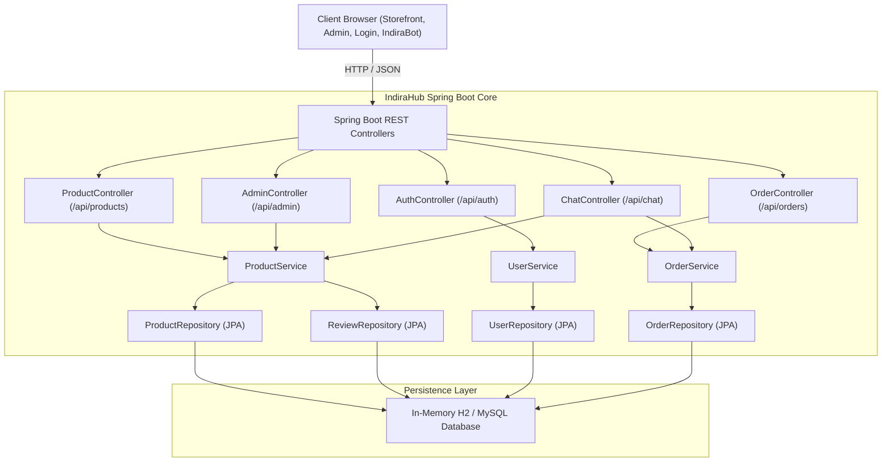
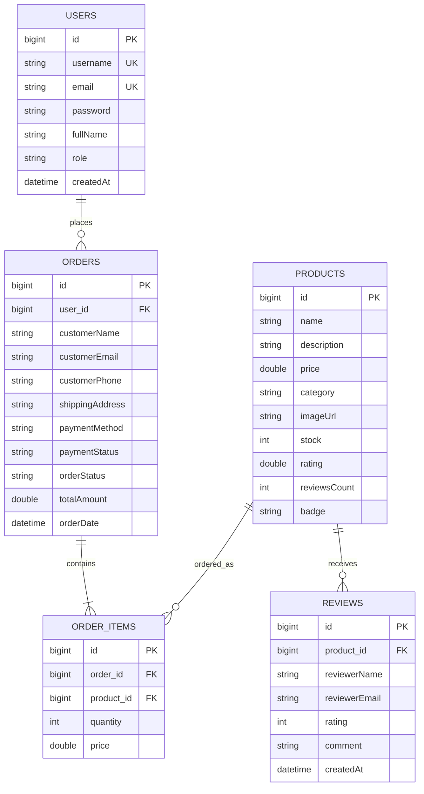

# ⚡ IndiraHub — Multi-Category E-Commerce & Lifestyle Platform

[](https://www.oracle.com/java/)
[](https://spring.io/projects/spring-boot)
[](https://www.h2database.com/)
[]()

IndiraHub is a full-stack, enterprise-ready modern e-commerce superstore built with **Spring Boot (Java 21)**, **Spring Data JPA**, **H2 / MySQL**, and a responsive frontend featuring an **AI Customer Support Chatbot**, **Seller Inventory Management**, **Order Workflow Pipeline**, and a **Customer Reviews & Ratings** system.

---

## 📑 Table of Contents
1. [Key Features](#-key-features)
2. [Catalog Categories](#-catalog-categories)
3. [System Architecture](#-system-architecture)
4. [Database Schema (ER Diagram)](#-database-schema-er-diagram)
5. [REST API Documentation](#-rest-api-documentation)
6. [Milestone Compliance Checklist](#-milestone-compliance-checklist)
7. [Running Locally](#-running-locally)
8. [Testing & Verification](#-testing--verification)
9. [Deployment Guide](#-deployment-guide)

---

## 🌟 Key Features

- **Storefront & Catalog**:
  - Live filtering across 8 distinct lifestyle and tech categories.
  - Multi-field keyword search and dynamic sorting (Price Low/High, Rating, Featured).
  - High-definition visuals, badge indicators (*Bestseller*, *Trending*, *Hot*), and live inventory levels.

- **Fulfillment & Cart Engine**:
  - Real-time slide-over Cart Drawer with free shipping threshold meter (Free shipping > ₹999).
  - Multi-item Checkout modal with payment options (UPI / QR Code, Cash on Delivery, Credit/Debit Card).
  - Automated stock reservation and decrement upon order confirmation.

- **Seller Dashboard & Admin Panel (`/admin.html`)**:
  - **KPI Analytics**: Real-time revenue calculations, active order counts, listed items, and low-inventory alerts.
  - **Order Workflow Pipeline**: Status transitions (`CONFIRMED` ➔ `PROCESSING` ➔ `SHIPPED` ➔ `DELIVERED` ➔ `CANCELLED`).
  - **Listing Management**: Add new products with image preview, update price/stock, and delete listings.

- **Customer Reviews & Ratings**:
  - Interactive 5-star rating submission form with verified customer feedback.
  - Dynamic recalculation of average ratings and total review counts stored in JPA.

- **AI Support Assistant (`IndiraBot`)**:
  - Floating bottom-right assistant widget powered by a backend proxy endpoint (`/api/chat`).
  - NLP intent matching for product recommendations, delivery policies, return guidelines, and order tracking.

---

## 🏷️ Catalog Categories

1. **📱 Electronics**: Laptops, 5G smartphones, ANC headphones, mechanical keyboards, gaming monitors.
2. **🏠 Home Decor**: Levitating moon lamps, zero-gravity lounge chairs, ceramic vases, sunset projection lamps.
3. **🏋️ Fitness**: Heavy-duty inversion boots, dial adjustable dumbbells, high-density yoga mats, smart jump ropes.
4. **🍳 Kitchen & Baking**: Convection air fryers, gravity-defying illusion cake kits, Damascus chef knives, cast iron dutch ovens.
5. **💄 Beauty & Makeup**: Zero-G velvet matte primers, chromatic eyeshadow palettes, vitamin C serums, matte lip sets.
6. **👗 Apparel & Fashion**: Sculpting compression midi dresses, French terry hoodies, weatherproof jackets, sling bags.
7. **🥨 Groceries & Snacks**: Freeze-dried fruit medleys, Himalayan roasted foxnuts (makhana), ceremonial matcha, dark chocolate barks.
8. **📚 Books**: Mastering Java & Spring Boot, Python for AI, Data Structures & Algorithms, fiction bestsellers.

---

## 🏛️ System Architecture



---

## 🗄️ Database Schema (ER Diagram)



---

## 🔌 REST API Documentation

### Products
| Method | Endpoint | Description |
|---|---|---|
| `GET` | `/api/products` | Retrieve all items (supports `?category=...` and `?search=...`) |
| `GET` | `/api/products/{id}` | Retrieve single item details |
| `GET` | `/api/products/categories` | Retrieve list of all unique categories |
| `POST` | `/api/products` | Add new product listing (Seller / Admin) |
| `PUT` | `/api/products/{id}` | Update product price, stock, or details |
| `DELETE` | `/api/products/{id}` | Delete product listing |
| `GET` | `/api/products/{id}/reviews`| Fetch customer reviews for a product |
| `POST` | `/api/products/{id}/reviews`| Submit new customer review & rating |

### Authentication
| Method | Endpoint | Description |
|---|---|---|
| `POST` | `/api/auth/register` | Register new customer account |
| `POST` | `/api/auth/login` | Authenticate username/email & password |

### Orders & Workflow
| Method | Endpoint | Description |
|---|---|---|
| `POST` | `/api/orders` | Place new order with line items |
| `GET` | `/api/orders` | Fetch orders (supports `?email=...` or `?userId=...`) |
| `GET` | `/api/orders/{id}` | Fetch order details by ID |
| `PUT` | `/api/orders/{id}/status` | Update fulfillment status (`status=SHIPPED`, etc.) |

### Admin & Analytics
| Method | Endpoint | Description |
|---|---|---|
| `GET` | `/api/admin/stats` | Store metrics (revenue, orders, inventory alerts) |

### AI Chatbot Assistant
| Method | Endpoint | Description |
|---|---|---|
| `POST` | `/api/chat` | AI intent resolution, recommendations & order tracking |

---

## 📋 Milestone Compliance Checklist

- [x] **Milestone 1**: Problem statement locked, repository initialized, Tomcat/Maven skeleton running, DB schema v1.
- [x] **Milestone 2**: Authentication (register/login/session), base DAO layer, deployed locally.
- [x] **Milestone 3**: Core flow: browse ➔ add to cart ➔ place order.
- [x] **Milestone 4**: Working MVP demo with full catalog.
- [x] **Milestone 5 & 6**: Seller dashboard (listing management) & Admin panel complete.
- [x] **Milestone 7**: Search/filter, order status workflow (`CONFIRMED` ➔ `PROCESSING` ➔ `SHIPPED` ➔ `DELIVERED`).
- [x] **Milestone 8**: Reviews & ratings system, edge case handling, input validation.
- [x] **Milestone 9**: Security requirements & unit/DAO test suite coverage.
- [x] **Milestone 12 & 13**: AI chatbot integration (proxy controller + floating widget) & README architecture documentation.

---

## 🚀 Running Locally

### Prerequisites
- **JDK 17+** (JDK 21 LTS recommended)
- **Apache Maven 3.9+** (or use bundled `./mvnw.cmd` wrapper)

### Start the Server
```powershell
# From the project root
.\mvnw.cmd spring-boot:run
```

Once started, access the application in your browser:
* **Storefront**: [http://localhost:8080/](http://localhost:8080/)
* **Seller / Admin Dashboard**: [http://localhost:8080/admin.html](http://localhost:8080/admin.html)
* **Sign In / Register**: [http://localhost:8080/login.html](http://localhost:8080/login.html)
* **H2 Database Console**: [http://localhost:8080/h2-console](http://localhost:8080/h2-console)
  * *JDBC URL*: `jdbc:h2:mem:indirahub`
  * *User*: `sa`
  * *Password*: *(leave empty)*

### Demo Accounts
- **Customer**: `demo` / `demo123`
- **Admin**: `admin` / `admin123`

---

## 🧪 Testing & Verification

Run the automated test suite with Maven:
```powershell
.\mvnw.cmd test
```
Includes:
- `BackendApplicationTests`: Spring Boot context load verification.
- `ProductServiceTest`: Catalog search, category filtering, and review recalculation tests.
- `OrderServiceTest`: Multi-item calculations, stock decrements, and status transitions.
- `UserServiceTest`: Registration validation, duplicate prevention, and login authentication.

---

## ☁️ Deployment Guide

### Deploying with Docker
```dockerfile
FROM eclipse-temurin:21-jre-alpine
VOLUME /tmp
COPY target/backend-0.0.1-SNAPSHOT.jar app.jar
ENTRYPOINT ["java","-jar","/app.jar"]
```

Build and run:
```bash
./mvnw clean package -DskipTests
docker build -t indirahub:latest .
docker run -p 8080:8080 indirahub:latest
```
Compatible with **Render**, **Railway**, **AWS Elastic Beanstalk**, or **Heroku**.
